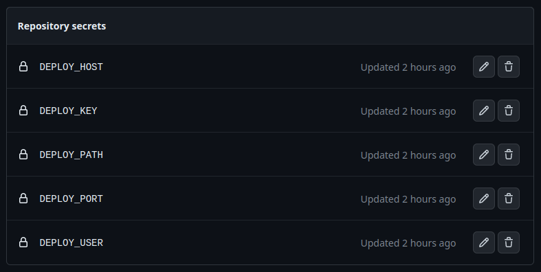

Actions feature on GitHub is really powerful tool. I used it to automate the deployment of my blog. Here's how I did it.
<!--more-->

**Please take into account it's not a tutorial per se.**

## Automation of what?

Currently to update articles or anything on this website I have to make the change locally, build a new HTML using `hugo`, copy the result from `public/` directory and paste it onto the remote server over SSH or other file transfer protocol. It's *a bit* cumbersome to do so. Then why can't we automate it?

The perfect workflow would look like this:
1. Make a local change and test it
2. Create a git commit
3. Push the changes to the remote repository
4. Magic happens...
5. The site is publicly updated!

The mysterious fourth step actually is the most important one. In this step the site is checked for errors and built using GitHub CI/CD and **the resulting files are copied to my server which is hosting them.**

## Why not use GitHub Pages?

*Wait.* Do we need to copy those files to a remote server? Can't we just use the [GitHub Pages](https://pages.github.com/)?
Pages allows us to host static websites on GitHub itself using our repository as data source and it's free. So...

**Of course we can.**

I decided to use my own hosting for a few not so important reasons. You can use GitHub Pages if you want to!
If you're really curious why do I chose *coping the files to a remote server* here are the reasons:

1. It's fun and it's an great opportunity to learn something new.
2. No need to use Google Analytics hence no cookies.
3. Greater control over the data, server settings and everything else.
4. I just have to start using those servers of mine...

## Setting up the server

For the server part I just created a new user in the system, set some permissions and generated an SSH key for him to give it to the GitHub workflow which will upload the files on his behalf.

### Creating a new user

I started with creating a new user with `useradd -m <username>`, adding him to the `www-data` group which is the default group used by the HTTP Server on UNIX using `usermod -aG www-data <username>` and it was basically done.

Eventually you may also need to set proper permissions for your data directory so your user can modify it.

### Generating an SSH Key

After switching to the new user's shell I created a new SSH Key pair by running `ssh-keygen`. Next I had to append the `~/.ssh/authorized_keys` file with our new public part of the key to allow users with it to connect. It can be done with `cat .ssh/<key-name>.pub >> ~/.ssh/authorized_keys`.

On the other host we can check if we can connect without problems by getting the private key and establishing a connection. If everything works, great.

## Spilling some secrets

Our workflows on GitHub have to know a few things to be able to copy the files over the network, among others:
- Where? ( `HOST`, `PORT`, `PATH` )
- Who? ( `USER`, `SSH_KEY` )

We can provide those secrets to the workflows by using something called ... **Secrets and variables** in our GitHub's repository settings.
It's pretty straightforward so I won't dwell on this.



As you can see I added a variable to all of those *things* I mentioned earlier. Now we can use them in our scripts and nobody will see their uncovered values.

## Setting up new workflows

Workflows configurations are just files put in the `.github/workflows/` directory from root of our repository. GitHub will automatically recognize them and execute the content if the conditions of the execution specified in them are met.

### Check for errors action

First workflow will only compile our website and see if it won't explode compile time.

```yml
# ...
on: push # run on every push to the repository

jobs:
  build:
    # ...
    steps:
      - uses: actions/checkout@v3 # get the source code
        with:
          submodules: true # true because, we use them for themes
          # ...

      - name: Setup Hugo # guess what it does
        uses: peaceiris/actions-hugo@v2
        with:
          hugo-version: 'latest' # use latest version of Hugo

      - name: Build # let's see if it explodes
        run: hugo --minify
```

[See full version of this file on GitHub](https://github.com/ezioleq/ezioleq-blog/blob/105ec0fb6434350f16a5798f7d543fc03ff7214c/.github/workflows/build.yml)

Now on every push no matters to which branch we push this action should run and tell us if our site is building without any errors.

### Deploy action

Second workflow will build and deploy the finished website to the internet by using [rsync action](https://github.com/marketplace/actions/rsync-deployments-action) and transferring the files to our remote server.
As you can see we're also using here the variables which we set earlier in the repository settings.

```yml
# ...
on:
  push:
    branches:  # this time we are running the job
      - master # only when the changes are pushed
               # to the master branch

      # ...
      - name: Build
        env:
          HUGO_ENV: production # it's not necessary but just in case
        run: hugo --minify

      - name: Deploy # here's where the magic happens
        uses: burnett01/rsync-deployments@6.0.0
        with:
          switches: -avzr --delete
          path: public/
          remote_path: ${{ secrets.DEPLOY_PATH }}
          remote_host: ${{ secrets.DEPLOY_HOST }}
          remote_port: ${{ secrets.DEPLOY_PORT }}
          remote_user: ${{ secrets.DEPLOY_USER }}
          remote_key: ${{ secrets.DEPLOY_KEY }}
```

[See full version of this file on GitHub](https://github.com/ezioleq/ezioleq-blog/blob/105ec0fb6434350f16a5798f7d543fc03ff7214c/.github/workflows/deploy.yml)

And it's done! Whenever we push anything to the `master` branch it will be built and pushed onto our server. Right into specified by us directory. What's next? In my case I'm just serving those file through [nginx](https://www.nginx.com/). That's how you can read this article right now ;)

## Final words

I really like this kind of workflow *(11th usage of this word)*. It's dead simple to work with, you have advantages of using git version control system and you're even allowing other people to write their articles for your website by opening a pull request or just maybe fix your typos (assuming your repository is public).

Check as well something called [Branch Protection Rules](https://docs.github.com/en/repositories/configuring-branches-and-merges-in-your-repository/managing-protected-branches/managing-a-branch-protection-rule).
By using it you can block direct pushes to the `master` branch and make sure that pushed code (e.g. from pull request) will generate static files without any problems by seeing result of our `Build` job.

I'm also aware this article is a bit chaotic but you have to forgive me for that. Maybe you have noticed (for sure you did) that I didn't use a translator for the whole text so the Engrish can be strong.
Anyway I hope it will improve with time and number of written articles.

Any suggestions? Questions? Feel free to leave them in comments below, I'll be glad to read them!

### Useful resources

- [Deploying to a server via SSH and Rsync in a Github Action](https://zellwk.com/blog/github-actions-deploy/)
- [Moving from GitHub pages to self-hosted](https://belief-driven-design.com/moving-from-github-pages-to-self-hosted-ab1231fb7fa/)
- [GitHub Actions for Hugo](https://github.com/peaceiris/actions-hugo)
- [Rsync Deployments Action](https://github.com/marketplace/actions/rsync-deployments-action)
