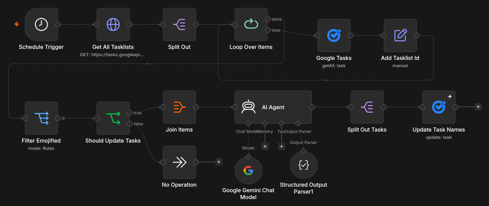

import MiniTask from './MiniTask.astro';
import MiniTaskList from './MiniTaskList.astro';

For over a year, every task I add to a list on Google Tasks has a best-describing
emoji assigned as a prefix to its title. I liked the methodology so much I even
automated this process to make sure *all my tasks have emojis*. Why is that,
and does it change anything in my day-to-day life?

## Readability

<Sidenote>
As of writing this, I find out interesting things every minute. It seems like GNOME
was keen on using icons in GTK2, but GTK3 deprecated them. Meanwhile, macOS 26 introduced
thousands of icons just to revert them in macOS 27, according to [this GIMP issue][gimp-issue].
Did not confirm this myself.
</Sidenote>

Well-chosen icons near frequent action items can improve the UX, drastically.
At least for me, I won't dive into scientific research nor professional UI guidelines.
The choice isn't so obvious, as you can see: Apple's macOS includes icons in context menus,
while Firefox and GNOME don't.

### Getting lost in plain text

I keep track of a few task lists; with many entries, it all becomes cluttered with
plain text, hard to navigate. Normally, I don't have a need to search for tasks,
but even if I needed to, Google Tasks does not provide such a feature!

The easiest way, then, is just to scan for tasks in a given list. Here's a little
example of how such a list looks before emojification and after.

<Sidenote>
On mobile, this table can have a hard time illustrating *the issue* due to text wrapping
in the table's columns.
</Sidenote>

<MiniTaskList>

|Tasks (before)|Tasks (after)|
|---|---|
|<MiniTask title="Water the plants" description="They are so dry I don't think the water's gonna help them"/>|<MiniTask title="🪴 Water the plants" description="They are so dry I don't think the water's gonna help them"/>|
|<MiniTask title="Make a weekly shopping list" description="I need some bacon for sure"/>|<MiniTask title="🛒 Make a weekly shopping list" description="I need some bacon for sure"/>|
|<MiniTask title="Write a blog post about emojis" description="Why would anyone want to read such a thing?" done/>|<MiniTask title="✍️ Write a blog post about emojis" description="Why would anyone want to read such a thing?" done/>|

</MiniTaskList>

It's a small sample, but it scales. When you have dozens of tasks, it quickly becomes
visually hard to see through.

<Sidenote>
Maybe other task management apps are better at all this, but I'm still giving a chance
to Google Tasks as, at the moment, it's the simplest way to manage things to do and
integrate them into Google Calendar, which I use too.
</Sidenote>

I like how I can see *the idea* of a task and what it's related to just by
looking at it.

## Assigning emojis by hand

At the beginning, I assigned every emoji before a new task's title by hand.
Generally, it was quite simple and fast - think of an emoji, pick it, save it.

<Sidenote>
A site I sometimes use to this day is [EmojiDB][emojidb], which works as a dead simple
words-to-emojis database. It can ease the struggle with picking up the right emoji.
*When you have some extra time to spare.*
</Sidenote>

The problem was... the time and attention needed to find the one icon and put it there.
You just want to write down a thing and hide your phone back to the pocket. The outcome
was contradictory. I saved milliseconds on reading by spending seconds on writing.

Then I remembered the ongoing automation trend, especially with [n8n][n8n].
I almost missed it all because I simply didn't have anything *more* to automate
as I think my workflows are pretty simple and do not need all this extra processing.

## Automation

A simple workflow gathers all the tasks from my Google account and assigns the best-fitting
emojis as prefixes for their titles. What would it be without the use of AI?



The entire job runs every 5 minutes and looks like this:

1. Get all task lists and their tasks
2. Assign the parent list identifier to every task
3. Filter tasks which already have an emoji at the beginning of the title
4. Ask an AI model for the best-matching emoji and prefix the name
5. Split the resulting structured JSON and update every task

### Keeping the rent low

You may ask why it's done this way and not another. There's adding a task list
identifier to a task, joining, then splitting... There are two main factors that
lead up to this:

1. **Rate limits** - to keep the costs minimal, I prefer to ask the model **once** for
an answer and perform a bulk update. A single request has all the needed data.
No need - no request.
1. **Support for multiple task lists** - Making a single request requires including
an identifier of a list the task is coming from.

This way I can easily run the workflow multiple times an hour with a total cost
of **$0**. Without hitting any limits on the Google Tasks API or the Gemini API side.

<Sidenote>
Throughout the months I experimented with different models, especially
with Gemini. I started with `gemini-2.0-flash`, tried `gemini-2.5-flash` as the first
one *was gone*, and now it works with `gemini-3.1-flash-lite`, which has enormous limits
on the free tier.
</Sidenote>

#### A glimpse on the JSON structure

Just to demonstrate how the mentioned *single request* looks in practice.

```json
"input": [
  {
    "title": "An example",
    "taskId": "aUxrSHFEVlRIYm8xT0hUOQ",
    "tasklistId": "MzQ2MjYwMzY2ODM1NDIwMzc0MTM6MDow"
  }
]
```

```json
"output": [
  {
    "title": "📝 An example",
    "taskId": "aUxrSHFEVlRIYm8xT0hUOQ",
    "tasklistId": "MzQ2MjYwMzY2ODM1NDIwMzc0MTM6MDow"
  }
]
```

Yes, this solution is wasting tokens on processing the identifiers, etc., but at
this scale it does not matter at all. The per-request limits are more painful
than tokens.

And yes, you're giving your task names to a big and evil corporation to be processed
by their artificial intelligence. At least it's still under the same umbrella
as the task manager and calendar.

### It's not ideal, technically

<Sidenote>
Nothing's ideal, but **it just works**. If there was anything I couldn't live with,
then I'd probably fix it right in place.
</Sidenote>

The Google Tasks authorization needs to be refreshed every week as OAuth apps
without verification can't work any longer. Now I don't mind, but the need to
log in to the n8n credentials manager and refresh the connection is real.

There were also times when some updates to n8n itself were breaking the workflow.
Fortunately, the fixes were pretty simple; nonetheless, it shows how fragile the
solution actually is.

### What if not AI

More as a sidenote, but I was thinking about *how to pick the best emoji for my task*
without involving LLMs as it feels like shooting at a fly with a bazooka.

Unfortunately, it wasn't that simple. You could build some sort of dictionary
of keywords and emoji names, and match them with titles. For sure there are ways
to make it work. This uncertainty led to the use of Gemini. A light model is ideal for
a job like this - classify action, find corresponding icon, assign.

The other way I'd think of, without LLMs, is to use something like [EmojiDB][emojidb],
but as far as I know they do not provide a public API. To make it work you'd need
to write a scraper and query the service with your task name or its elements.

*Then you remember there are more languages in the world than English.*

## Icons are nice, not only in task titles

I started this post by noticing action items, context menus and general UX.
This post is heavily focused on emojis and tasks; I feel it. Seizing the opportunity,
I'd like to give you a few examples where icons / emojis are nice too and where I
use them too.

- **Obsidian** - with the use of the [Iconize][iconize] plugin, I assign icons to my folders
and important notes. I like the look of them and they work for me the same way emojis
in task names do, instantly seeing what it's about.
- **Calendar** - this one is purely aesthetic; most of the events in my calendar have
emojis prefixed to the title as I like the look. Particularly with [At a Glance][at-a-glance].
Not a rule though.
- **Attention grabbers** - mostly in text, when I want to grab readers' attention and
give a specific feeling. An example of this would be prepending an important message
with "⚠️". Personally, I do this only at work.

### Not everything needs an emoji

It's not like I add an emoticon to every checkbox I write. I do not include
emojis in the GitHub issues or Jira tickets I report. I do this where I find it
viable to provide a value, whether it's an aesthetic or practical one.

Back in the day, I loved adding emojis to headers in repositories' README files.
I found this eye-pleasing and good for navigation when you could see a little "🏗️"
icon next to the "Building" section of a document.

It has changed, and now I prefer clear and concise descriptions. Notably in
documentation, and I feel like such a README is one. I can also blame the masses
of AI-slop produced every hour and their distinctive way of writing, often
full of emojis. Emojis are very easy to overdose on and produce **visual clutter**.

## It's all personal

<Sidenote>
Usually I don't think too much about the points I described here. It was a bit off
to write about them because I had to come up with the idea and *why* I do this.
It's natural, it's a preference; sometimes rationalizing your habits may help you
understand them, and this was my take.
</Sidenote>

This post touched on at least a few different topics. It was(n't) intended.
A few things needed to be pointed out, and about some I just forgot. The key takeaway
should be:

**This is not a tutorial nor a recommendation.** I wanted to show what, why and
how I do the emojis. Maybe you will find something helpful here and try it yourself!

*See ya!*

[gimp-issue]: https://gitlab.gnome.org/Teams/GIMP/Design/gimp-ux/-/work_items/81
[n8n]: https://n8n.io/
[emojidb]: https://emojidb.org/
[iconize]: https://community.obsidian.md/plugins/obsidian-icon-folder
[at-a-glance]: https://support.google.com/pixelphone/answer/14884067?hl=en
