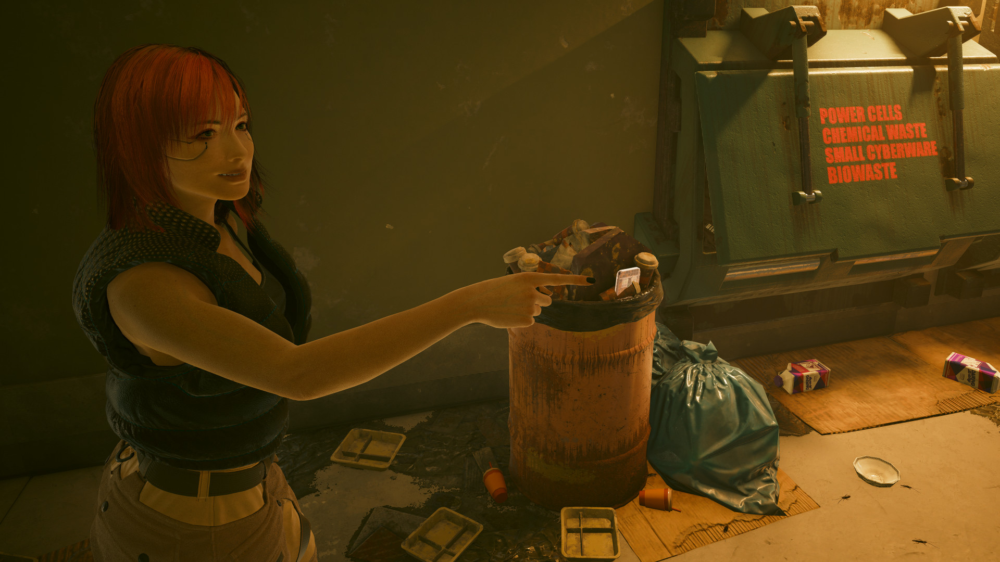
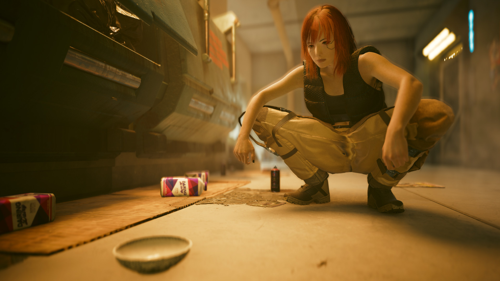
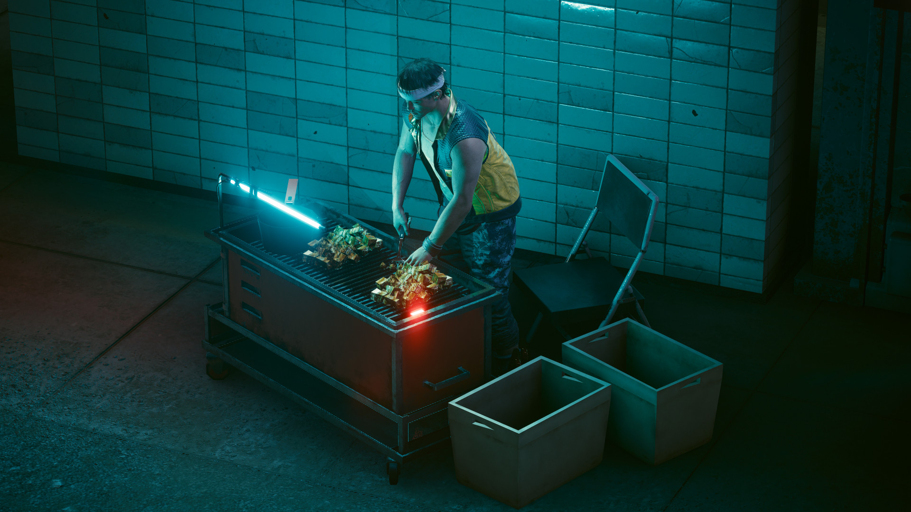
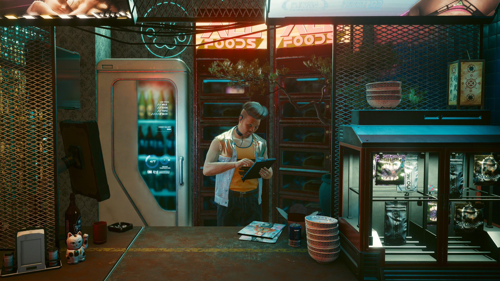
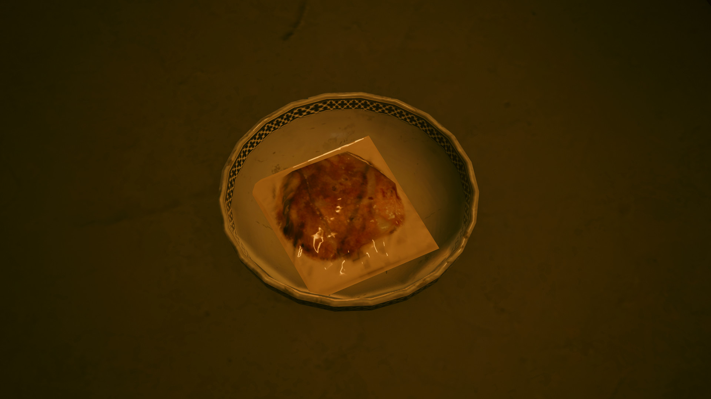
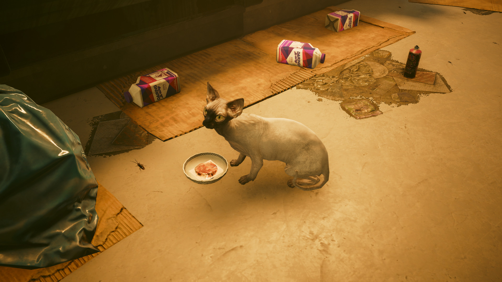
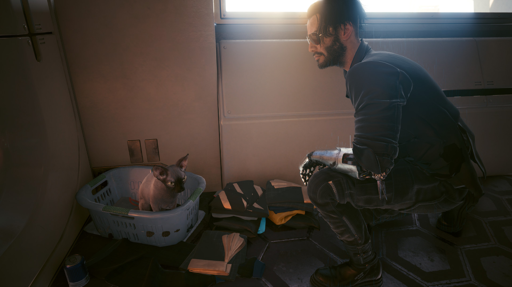

A story of a girl who feed the Cat. What difficulties did she face?
<!--more-->

So I left my apartment at Megabuilding H10 with some trash to take out and spotted a Shard.
The shard was in the trash can and recklessly I've put it into my head to my crazy shard connector and read it's content. It was about feeding the cat. They wanted someone to finally feed the cat. So... I had to feed the cat.

Next to the trash can I saw an empty bowl. I supposed the food have to be placed there, like the cat probably will eat only from that bowl and he's waiting for someone to feed him. Exactly from this one bowl.

I took an elevator to the street level and started searching for some cat food. I was passing a few street food sellers but none of them wanted to talk with me. Maybe because I was pointing a gun to their heads. Never mind.

Finally I found the one! The guy in funky white jacket and an orange shirt. He sold me the cat food (it was 5 eurodollars for a pack) and I headed back to my apartment, where the bowl were. It's worth to mention that I bought like 6 packs of this goodies, one for the cat and five for me. It's hard to fight with mega corporations with an empty stomach.

The food finally landed in the bowl. There's no cat so far so I turned back to the bedroom and took a 13 hours nap. When I woke up I checked the bowl again and voilà, theres a living creature there.

It was a sphynx cat with a snow white skin and darker muzzle. I decided to took him to my home. Just grab it and move a few meters. What wrong can happen?

Just as I thought noting bad happened during the move and the cat is now mine and is living in my apartment. In a small laundry basket. He seems comfortable so do I. Johnny is looking happy about him in our family by accident too.

It was an amazing time, the looking for food adventure, speechless merchants and feeding a real animal for the first time. I hope the cat will stay with us till the end and will watch the Arasaka burning with us.
